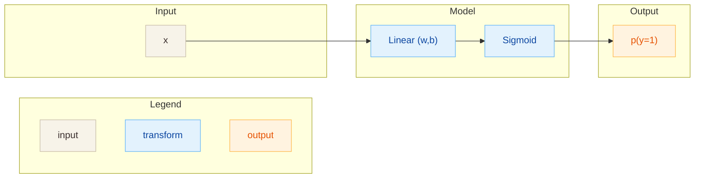

# Linear Models (Logistic Regression)

## Архитектура
Однослойная логистическая регрессия для бинарной классификации.

- Вход: вектор признаков $x \in \mathbb{R}^D$
- Параметры: $w \in \mathbb{R}^D$, $b \in \mathbb{R}$
- Выход: вероятность класса 1

## Диаграмма

## Теория
Линейная модель со сигмоидой, интерпретируемая как аппроксимация $P(y=1|x)$.
Оптимизирует выпуклый лог-лосс, что дает устойчивое обучение и понятные веса.

## Формулы
**Прямой проход**
$$
z = w^T x + b,\quad p = \sigma(z) = \frac{1}{1 + e^{-z}}
$$

**Лосс (binary cross-entropy)**
$$
L = -\bigl[y \log p + (1 - y)\log(1 - p)\bigr]
$$

**Регуляризация (опционально)**
$$
L_{L2} = L + \frac{\lambda}{2}\lVert w\rVert_2^2,\quad
L_{L1} = L + \lambda \lVert w\rVert_1
$$

**Градиенты**
$$
\frac{\partial L}{\partial w} = \frac{1}{N} X^T (p - y) + \text{reg},\quad
\frac{\partial L}{\partial b} = \frac{1}{N} \sum (p - y)
$$

## Применимые задачи
- Бинарная классификация табличных признаков
- Базовый бейзлайн для текста после TF-IDF/BoW
- Калибровка вероятностей

## Плюсы
- Быстрое и стабильное обучение
- Интерпретируемые веса
- Хорошо работает как базовая линия

## Минусы
- Только линейные зависимости
- Ограниченная выразительность без признакового инжиниринга
