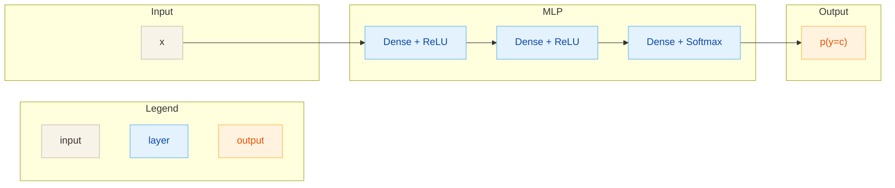

# Perceptron (MLP)

## Архитектура
Многослойный перцептрон для многоклассовой классификации.

- Вход: $x \in \mathbb{R}^D$
- Скрытые слои: ReLU
- Выход: softmax по $C$ классам
- Параметры: для каждого слоя $W_l, b_l$

## Диаграмма

## Теория
MLP добавляет нелинейности между линейными слоями и может аппроксимировать
сложные зависимости. Обучение идет через backprop и кросс-энтропию.

## Формулы
**Прямой проход (слой $l$)**
$$
Z_l = A_{l-1} W_l + b_l,\quad
A_l = \text{ReLU}(Z_l),\quad
A_L = \text{softmax}(Z_L)
$$

**Softmax**
$$
\text{softmax}(z_i) = \frac{e^{z_i}}{\sum_j e^{z_j}}
$$

**Лосс (cross-entropy)**
$$
L = -\frac{1}{N}\sum_{n}\sum_{c} y_{n,c}\log p_{n,c}
$$

**Backprop (идея)**
$$
dZ_L = \frac{P - Y}{N},\quad
dZ_l = dA_l \odot \text{ReLU}'(Z_l)
$$
$$
dW_l = A_{l-1}^T dZ_l,\quad db_l = \sum dZ_l
$$

## Применимые задачи
- Классификация табличных данных
- Базовые задачи CV после векторизации
- Бейзлайн для многоклассовых задач

## Плюсы
- Нелинейная модель
- Простая реализация и обучение
- Гибкость по числу слоев

## Минусы
- Требует настройки регуляризации и режима обучения
- Чувствителен к масштабу признаков
- Не учитывает структуру последовательностей/изображений
