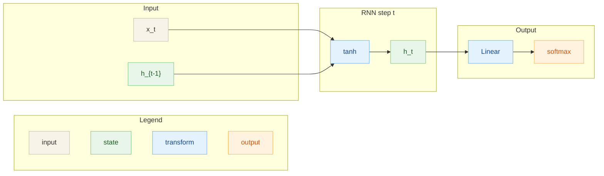

# RNN (Elman)

## Архитектура
Классическая Elman RNN для предсказания следующего символа.

- Вход: one-hot $x_t \in \mathbb{R}^V$
- Скрытое состояние: $h_t \in \mathbb{R}^H$
- Выход: логиты $o_t \in \mathbb{R}^V$

## Диаграмма

## Теория
RNN передает состояние по времени, что позволяет моделировать зависимости
между шагами последовательности. Обучение идет через BPTT и softmax.

## Формулы
**Прямой проход (шаг $t$)**
$$
a_t = W_{xh} x_t + W_{hh} h_{t-1} + b_h,\quad
h_t = \tanh(a_t)
$$
$$
o_t = W_{hy} h_t + b_y,\quad
p_t = \text{softmax}(o_t)
$$

**Лосс (по времени)**
$$
L = -\frac{1}{T}\sum_t \sum_i y_{t,i}\log p_{t,i}
$$

**BPTT (кратко)**
$$
d o_t = p_t - y_t,\quad
d h_t = W_{hy}^T d o_t + W_{hh}^T d h_{t+1}
$$
$$
d a_t = d h_t \odot (1 - h_t^2)
$$

## Применимые задачи
- Предсказание следующего символа/токена
- Простые последовательностные задачи
- Бейзлайн для NLP

## Плюсы
- Простая и быстрая модель
- Учитывает порядок и контекст
- Хороший стартовый бейзлайн

## Минусы
- Затухание/взрыв градиентов на длинных последовательностях
- Ограниченная память о дальнем контексте
