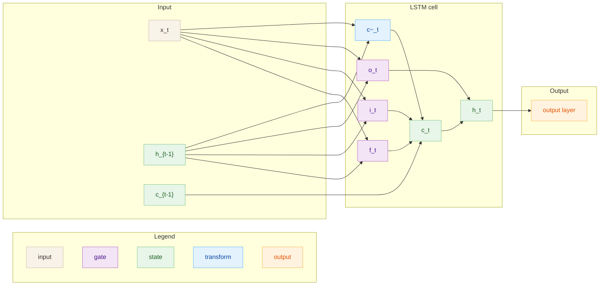

# LSTM

## Архитектура
LSTM-ячейка с входными/выходными/забывающими воротами и памятью $c_t$.

- Вход: $x_t \in \mathbb{R}^D$
- Скрытое состояние: $h_t \in \mathbb{R}^H$
- Состояние памяти: $c_t \in \mathbb{R}^H$

## Диаграмма

## Теория
LSTM добавляет память $c_t$ и ворота, что уменьшает затухание градиента
и улучшает работу с длинным контекстом.

## Формулы
**Ворота и состояние (шаг $t$)**
$$
f_t = \sigma(W_f x_t + U_f h_{t-1} + b_f),\quad
i_t = \sigma(W_i x_t + U_i h_{t-1} + b_i)
$$
$$
o_t = \sigma(W_o x_t + U_o h_{t-1} + b_o),\quad
\tilde{c}_t = \tanh(W_c x_t + U_c h_{t-1} + b_c)
$$
$$
c_t = f_t \odot c_{t-1} + i_t \odot \tilde{c}_t,\quad
h_t = o_t \odot \tanh(c_t)
$$

**Выходной слой (классификация)**
$$
\text{logits} = W_y h_T + b_y,\quad
p = \text{softmax}(\text{logits})
$$

**Лосс**
$$
L_{cls} = -\log p[y],\quad
L_{lm} = -\frac{1}{T}\sum_t \log p_t[y_t]
$$

## Применимые задачи
- Последовательностная классификация
- Языковое моделирование
- Временные ряды с долгими зависимостями

## Плюсы
- Лучше удерживает дальний контекст
- Стабильнее обучается, чем базовый RNN
- Универсальная архитектура для последовательностей

## Минусы
- Больше параметров и вычислений
- Медленнее обучения, сложнее тюнить
