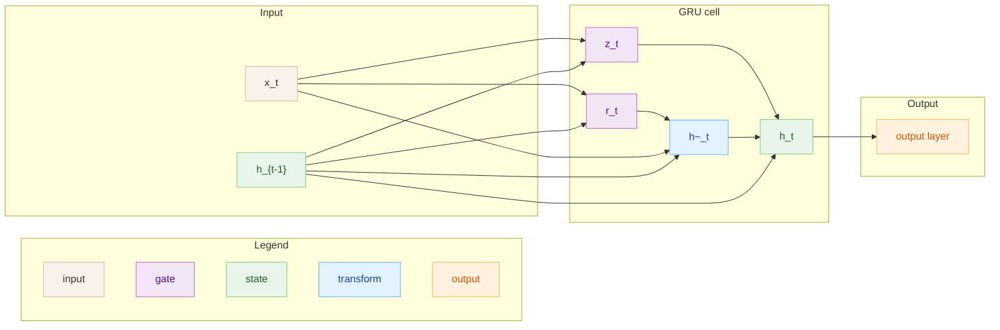

# GRU

## Архитектура
GRU-ячейка с воротами обновления и сброса.

- Вход: $x_t \in \mathbb{R}^D$
- Скрытое состояние: $h_t \in \mathbb{R}^H$

## Диаграмма

## Теория
GRU упрощает LSTM, убирая отдельную память $c_t$, но оставляя ворота,
что часто дает сопоставимое качество при меньшей сложности.

## Формулы
**Ворота и состояние (шаг $t$)**
$$
z_t = \sigma(W_z x_t + U_z h_{t-1} + b_z),\quad
r_t = \sigma(W_r x_t + U_r h_{t-1} + b_r)
$$
$$
\tilde{h}_t = \tanh(W_h x_t + U_h (r_t \odot h_{t-1}) + b_h)
$$
$$
h_t = (1 - z_t) \odot h_{t-1} + z_t \odot \tilde{h}_t
$$

**Выходной слой (классификация)**
$$
\text{logits} = W_y h_T + b_y,\quad
p = \text{softmax}(\text{logits})
$$

**Лосс**
$$
L_{cls} = -\log p[y],\quad
L_{lm} = -\frac{1}{T}\sum_t \log p_t[y_t]
$$

## Применимые задачи
- Последовательностная классификация
- Языковое моделирование
- Последовательности средней длины

## Плюсы
- Меньше параметров, чем LSTM
- Часто быстрее обучается
- Хороший компромисс качество/скорость

## Минусы
- Меньше контроля над памятью, чем в LSTM
- Может проигрывать на очень длинном контексте
