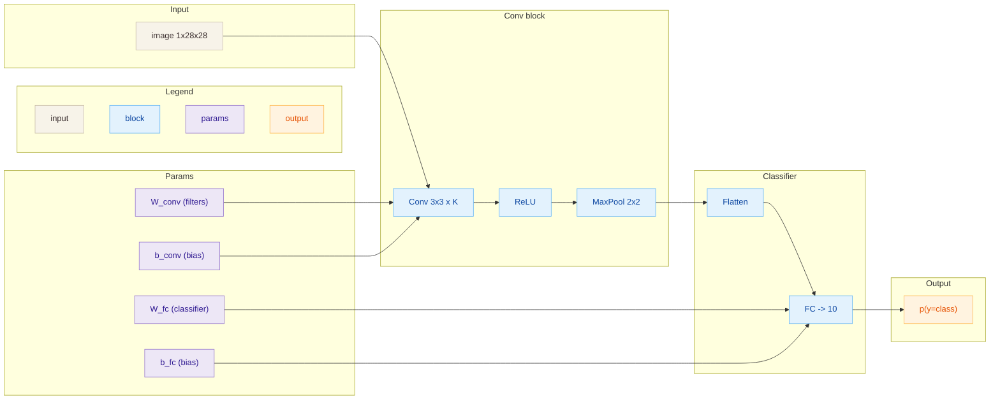

# CNN

## Архитектура
Минимальная CNN для MNIST: **Conv → ReLU → MaxPool → FC → Softmax**.

- Вход: изображение $1 \times 28 \times 28$
- Свертки: $K$ фильтров $3 \times 3$
- Пулинг: $2 \times 2$ (stride 2)
- Выход: 10 классов

## Диаграмма

## Теория
CNN использует локальные рецептивные поля и разделяемые фильтры, чтобы
выделять устойчивые к сдвигу признаки. Пулинг уменьшает размерность
и делает представление более инвариантным.

## Формулы
**Свертка**
$$
Y_{f,i,j} = \sum_{c=1}^C \sum_{u=1}^K \sum_{v=1}^K
W_{f,c,u,v} \cdot X_{c,i+u,j+v} + b_f
$$

**ReLU**
$$
\text{ReLU}(x) = \max(0, x)
$$

**MaxPool ($2\times 2$)**
$$
P_{c,i,j} = \max_{u,v \in \{0,1\}} X_{c,2i+u,2j+v}
$$

**Классификатор**
$$
z = \text{flatten}(P),\quad
\text{logits} = W z + b,\quad
p = \text{softmax}(\text{logits})
$$

## Применимые задачи
- Классификация изображений (MNIST, CIFAR)
- Извлечение локальных признаков
- Простые задачи компьютерного зрения

## Плюсы
- Мало параметров из-за разделения весов
- Хорошо ловит локальные паттерны
- Быстрее и стабильнее, чем полносвязные сети на изображениях

## Минусы
- Ограниченный контекст без углубления сети
- Требует подбора гиперпараметров (фильтры, пулинг)
- Упрощает геометрию, что может вредить точности
